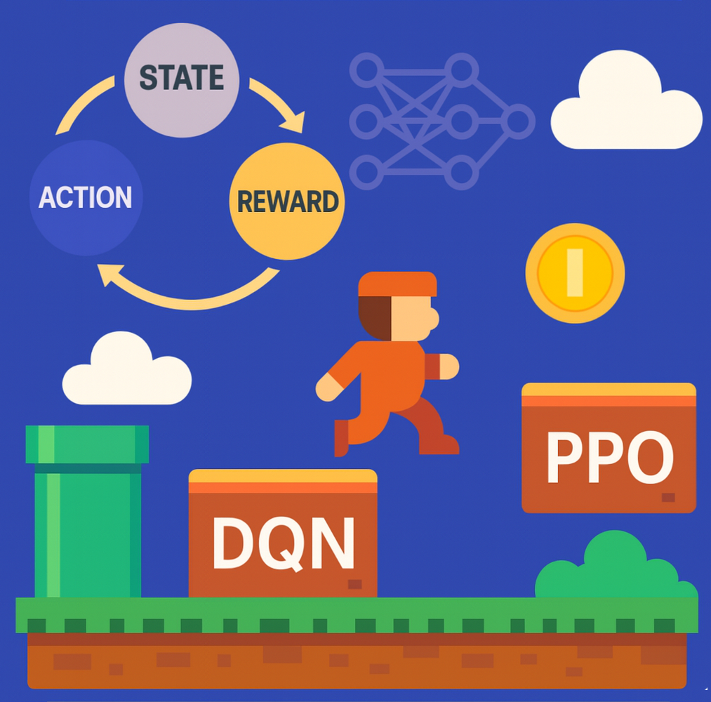

# RL-Mario Project Information



Welcome to the UNI-Vaasa Applied ML / Group20 "RL-Mario" project. This document introduces every core file, how they depend on each other, the important hyperparameters, and how to get from a fresh checkout to a running agent.

## Project Overview
- **Goal:** Train a Deep Q-Network (DQN) agent to play `SuperMarioBros-v0` using the right-only action space.
- **Core Loop:** `train.py` drives environment interaction, reward shaping, training, logging, plotting, and checkpointing. It imports the neural network and replay buffer from `agent.py`, frame processing/visualization utilities from `utils.py`, and can be paired with `eval.py` once a policy needs to be inspected.
- **Artifacts:** Training produces checkpoints in `checkpoints/`, metric dashboards in `assets/reward_plot.png`, and optional gameplay videos.

## Dependency Snapshot
| File | Imports From | Used By |
| --- | --- | --- |
| `agent.py` | Standard PyTorch/NumPy only | `train.py`, `eval.py` |
| `utils.py` | OpenCV, NumPy, Matplotlib, Pygame | `train.py`, `eval.py`, `watch_mario.py` |
| `train.py` | `agent.DQN`, `agent.ReplayBuffer`, `agent.select_action`, `utils.preprocess`, `utils.plot_rewards`, `utils.create_video_writer`, `utils.MarioViewer` | Entry point for training |
| `eval.py` | `agent.DQN`, `utils.preprocess`, `utils.create_video_writer`, `utils.MarioViewer` | Optional evaluation/recording script |

## File Guides

### `agent.py` — Model & Experience Buffer
- **Purpose:** Defines the convolutional DQN policy/value network, the `ReplayBuffer`, and the epsilon-greedy `select_action` helper.
- **Key Components:**
  - `class DQN(nn.Module)`: 3 convolutional layers + flatten + two fully connected layers. Expects grayscale 84×84 frames stacked as a single channel; outputs Q-values for each discrete action in the RIGHT_ONLY action space.
  - `class ReplayBuffer`: Fixed-capacity deque that stores `(state, action, reward, next_state, done)` tuples on CPU/GPU and samples random mini-batches.
  - `select_action(...)`: Epsilon-greedy policy with optional bias toward action `4` (high jump). Injects more high-jump attempts during exploration to help the agent escape obstacles.
- **Hyperparameters / Tunables:**
  - **Network depth** (Conv filters 32→64→64, linear 512): determines representational capacity; increasing depth improves pattern recognition but increases GPU memory and compute.
  - **Replay buffer capacity** (`capacity` arg in `ReplayBuffer`): larger buffers provide a wider experience distribution but consume more RAM.
  - **Exploration bias flags** (`encourage_high_jump` plus probabilities inside `select_action`): raising the probability of forced high jumps accelerates discovering obstacle-clearing strategies but can slow convergence once behavior is learned.
- **Typical Flow:** `train.py` instantiates `DQN` twice (policy/target networks), keeps experiences in the buffer, and calls `select_action` every step. `eval.py` instantiates a single `DQN` and runs it in eval mode (no buffer or epsilon randomness).

### `train.py` — Training Orchestrator
- **Purpose:** Complete training script: environment setup, reward shaping, epsilon scheduling, optimization, checkpointing, visualization, and metric plotting.
- **Important Sections:**
  1. **Hyperparameters:**
     - `EPISODES`, `MAX_STEPS`: control training Horizon. More episodes = better learning but longer runtime.
     - `GAMMA (0.99)`: discount factor for future rewards; higher values emphasize long-term rewards (e.g., clearing obstacles) but may slow adaptation to immediate signals.
     - `LR (1e-4)`: Adam optimizer learning rate; lower rates stabilize training, higher rates speed learning but risk divergence.
     - `BATCH_SIZE (32)`: number of replay samples per update; too small gives noisy gradients, too large demands more memory.
     - `EPS_START / EPS_END / EPS_DECAY`: shape exploration schedule. Slower decay keeps epsilon higher for longer, encouraging more exploratory jumps early on.
     - `TARGET_UPDATE (10 episodes)`: frequency of syncing target network with policy network; lower values reduce Q-value drift at the cost of extra copies.
     - `MEMORY_SIZE (100k)`: see `ReplayBuffer` notes above.
  2. **Reward/Control Parameters:**
     - `STUCK_THRESHOLD` / `MAX_STUCK_STEPS`: detect when Mario stops making progress and trigger forced exploration or episode termination. Lower thresholds make the agent reset quickly; higher thresholds attempt recovery longer.
     - `SLOW_PENALTY_DELAY`, `MAX_SLOW_PENALTY`: penalize loitering on the ground, pushing the agent to move or jump; tune these to balance patience vs. urgency.
     - `SPRINT_SPEED_LOW/HIGH`: boundaries for awarding sprint bonuses to forward velocity; tighten/loosen depending on how aggressive you want forward motion incentives to be.
     - `GRAD_CLIP_NORM`: clips gradients to keep updates stable when rewards spike.
  3. **Checkpoint & Visualization:** `SAVE_PATH`, `VIDEO_PATH`, `REWARD_PLOT_PATH`, `SHOW_VISUAL`, `DISPLAY_*` flags control artifacts and live display. Disable visuals when training headless to avoid pygame overhead.
- **Runtime Flow:**
  1. Builds Mario environment, policy/target networks, optimizer, replay buffer, and optional display/video writers.
  2. Optionally resumes from the latest `checkpoints/best_model_*.pt` or `checkpoints/dqn_mario.pt`.
  3. For each episode and each step: render frame (if needed), compute exploration epsilon (boosting when stuck), pick action via `select_action`, step the env, apply extensive reward shaping (progress, jump height/duration, unstuck bonuses, slow penalties, survival rewards), store transition, and train once replay buffer has enough samples.
  4. Logs rich per-episode stats (reward, x_pos, avg speed, jump counts, stuck detections) and saves the best-performing checkpoint with timestamps.
  5. After training, closes resources and calls `plot_rewards` to generate the multi-metric dashboard.
- **How Hyperparameters Affect Behavior:**
  - Raising `EPISODES` or lowering `EPS_DECAY` gives more exploration time to discover high jumps; pairing with higher `SPRINT_SPEED_HIGH` encourages fast movement once discovered.
  - Lowering `STUCK_THRESHOLD` increases aggressive restarts, useful if the agent frequently freezes.
  - Increasing `GRAD_CLIP_NORM` allows larger updates after big bonuses (e.g., obstacle clears) but risks instability; decreasing it can smooth learning if gradients explode.

### `utils.py` — Preprocessing, Plotting, and Visualization
- **Purpose:** Shared helpers for state preprocessing, metric plotting, video writing, and a pygame-based frame viewer.
- **Functions/Classes:**
  - `preprocess(frame)`: grayscale + resize to 84×84 + normalization. Must be kept consistent with what the DQN expects; changing output size requires adjusting `agent.DQN`'s first linear layer input (currently assumes 3136 = 64*7*7 flattened features).
  - `plot_rewards(metrics, save_path)`: renders any number of episode-level metric arrays in a grid layout, auto-labeling axes for known keys (reward, progress, air time, etc.). `train.py` feeds nine metrics; future metrics simply require adding a new entry to the dictionary.
  - `create_video_writer(...)`: chooses codec (H.264 on macOS, MP4 elsewhere) and ensures fallback; used by both training and evaluation scripts when they need MP4 output.
  - `class MarioViewer`: lightweight pygame window wrapper with scaling and event handling, preventing the main loop from blocking when visualizing frames in real time.
- **Dependencies:** Requires `opencv-python-headless` (or full OpenCV), `matplotlib`, `numpy`, and `pygame`. Ensure these packages match `requirements.txt` to avoid import errors.
- **Usage in Other Files:** `train.py` and `eval.py` rely on `preprocess`, `create_video_writer`, and `MarioViewer`; `plot_rewards` is called once at the end of training to save the dashboard.

### `eval.py` — Deterministic Policy Evaluation
- **Purpose:** Run a trained model without updating weights, log rewards/x_pos, optionally display gameplay, and record a video of the first evaluation episode.
- **Workflow:**
  1. Creates env identical to training (`SuperMarioBros-v0`, RIGHT_ONLY, RGB frames) and loads the latest available checkpoint (prefers `checkpoints/best_model_*.pt`, otherwise `checkpoints/dqn_mario.pt`).
  2. Sets the network to `eval()` mode and disables gradients.
  3. For each of `NUM_EVAL_EPISODES` (default 10): preprocesses frames, feeds them through the DQN to pick greedy actions, shows them in the `MarioViewer` window (if `SHOW_VISUAL`), and optionally records the episode to `assets/mario_eval.mp4`.
  4. Prints per-episode termination info and summarizes average reward/x_pos at the end.
- **Key Parameters:**
  - `MODEL_PATH`, `NUM_EVAL_EPISODES`, `MAX_STEPS`: control which checkpoint to load and how long to roll out. Increase episodes to estimate stability, decrease `MAX_STEPS` for faster sanity checks.
  - Display toggles mirror those in `train.py`; disable `SHOW_VISUAL` and video recording for headless batch evaluations.
- **Dependencies:** Shares the same `agent.py` network definition and `utils.py` helpers; must be run after at least one checkpoint exists.
- **When to Use:** Anytime you want to grade or demonstrate the policy without touching training (e.g., validating a new reward tweak, recording visuals for reports). Not required for training itself.

## Getting Started from Scratch
1. **Create & activate the project conda env:**
  ```powershell
  conda create -n rl-mario python=3.8
  conda activate rl-mario
  ```
2. **Install dependencies:**
  ```powershell
  pip install -r requirements.txt
  ```
3. **Train the agent (creates checkpoints, plots, optional video):**
   ```powershell
   python train.py
   ```
4. **Evaluate a trained policy (optional display/video):**
   ```powershell
   python eval.py
   ```
5. **Artifacts to check:**
   - Latest checkpoint(s): `checkpoints/best_model_*.pt` and `checkpoints/dqn_mario.pt`
   - Training metrics plot: `assets/reward_plot.png`
   - Optional videos: `assets/mario_training.mp4`, `assets/mario_eval.mp4`

## Tips for New Contributors
- Tweak hyperparameters in `train.py` under clearly marked sections; document any changes so others can reproduce your runs.
- When altering `utils.preprocess` or the network architecture, update both `agent.py` and any scripts feeding frames to the model.
- Keep `eval.py` in sync with `train.py` environment settings (action space, preprocessing) to ensure evaluation represents true policy behavior.
- If you do not need real-time visualization, set `SHOW_VISUAL = False` to avoid pygame overhead or crashes on headless servers.

With this guide, newcomers can quickly identify where core logic lives, how files interact, and which knobs to turn when experimenting with the Mario agent. Happy training!

## Update Log
- **18/11/2025 – AnssiO**
  - Restored 4-frame stacking in `train.py` (imports, `FRAME_STACK_SIZE = 4`, deque-based state buffer) so states are again presented as 4-channel tensors, keeping the current DQN weights and checkpoints compatible without retraining. `eval.py` already used the same structure, so no changes were necessary there.
  - Fixed the high-jump progress log f-string by switching the inner quotes to single quotes, resolving the syntax error that previously halted training.
